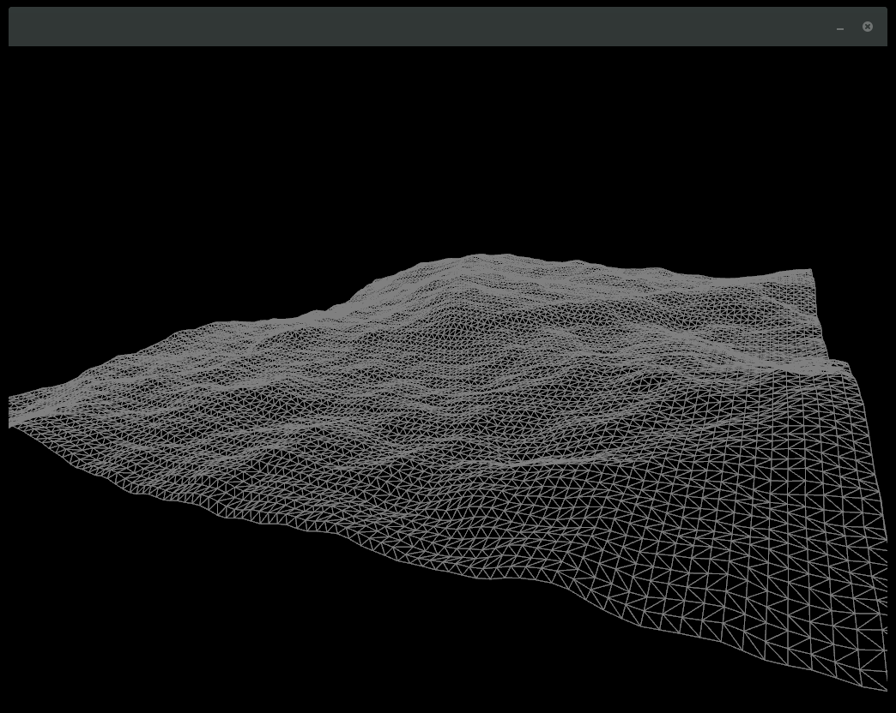
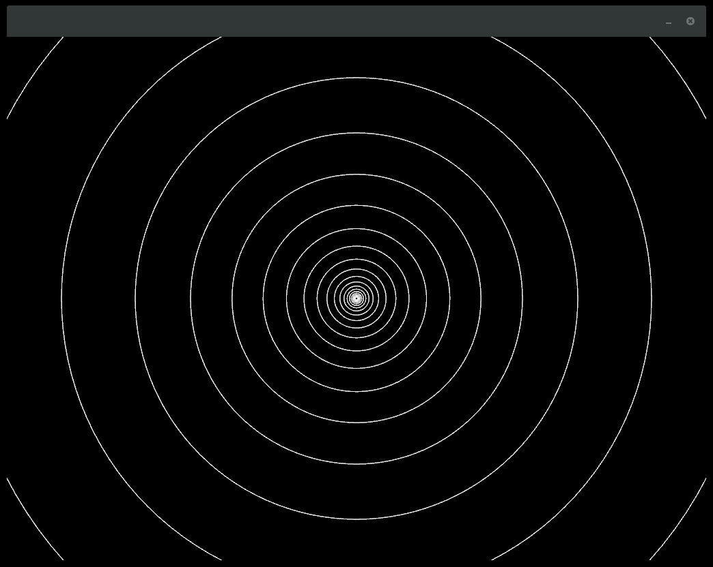
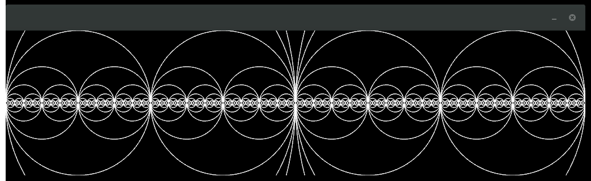
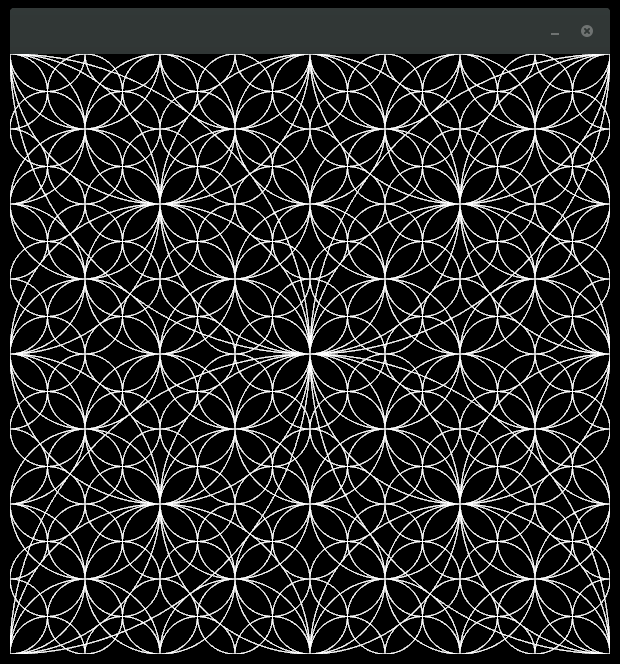
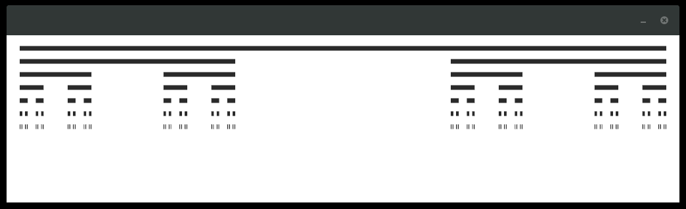
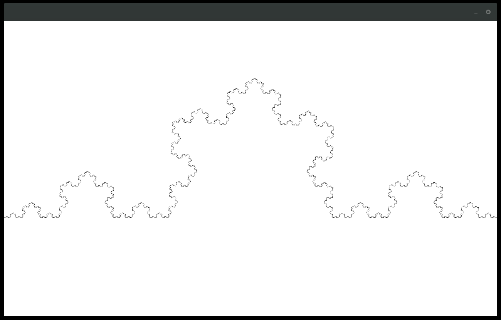
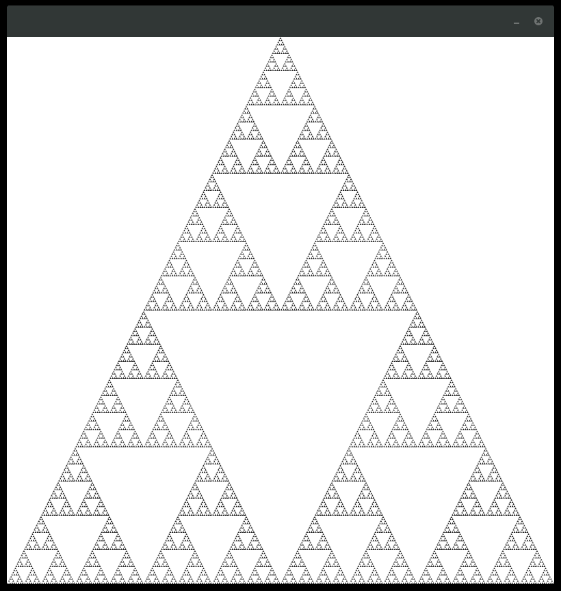

# ofNatureOfCode
#### Nature Of Code Examples implemented using Openframeworks

This repository holds some examples from Daniel Shiffmans excellent book [The Nature Of Code](http://natureofcode.com/) reimplemented using [Openframeworks](openframeworks.cc) (basically the [ofnode](https://github.com/ofnode) fork).

### ofnode

[ofnode](https://github.com/ofnode) is an Openframeworks fork and provides several improvements for the ofx build system.

- CMake support
- Nice addon handeling using git submodules

### Building

comming soon

### Examples
#### 1. Vectors

##### 1.10. Perlin Landscape

---

#### 8. Fractals

##### 8.01. Recursive Circles

##### 8.02. Recursion Twice

##### 8.03. Recursion Four Times

##### 8.04. Cantor Set

##### 8.05. Koch Curve

##### 8.05. Sierpinski Triangle

